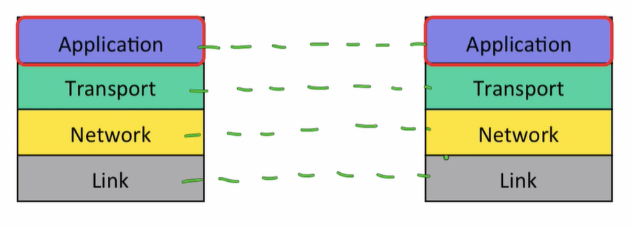
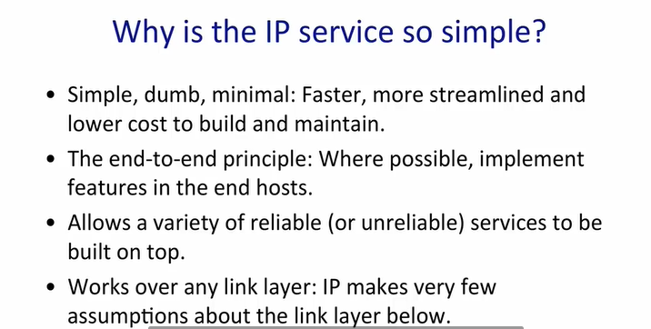
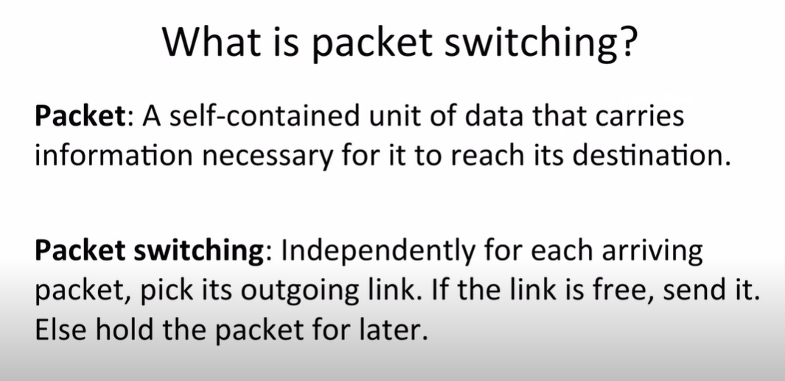
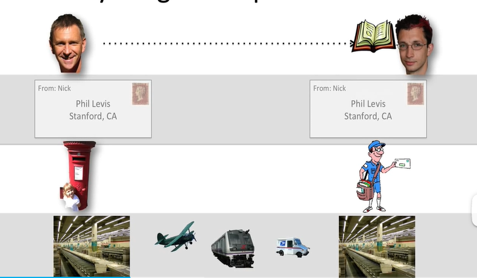
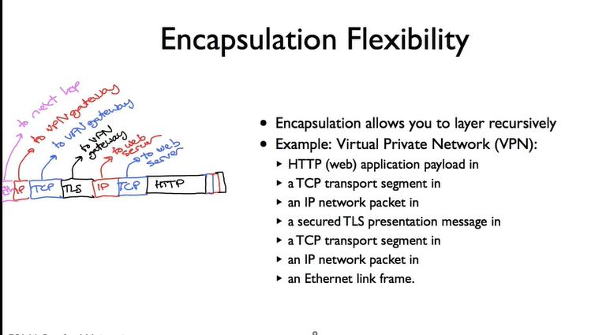

最初的四层基本模型:

当我们数据包运送到network的时候,就必须使用Internet Protocol(IP),它以后会详细介绍,但现在可以讲一些基本信息:

ip无法保证数据包被安全传输,所以应用程序要想数据按顺序,完整的交付给别人,我们就要在ip之上运行另一个协议,传输层的工作.

它的Tcp可以保证数据正确传输,但其实并不是所有应用都需要正确传输数据.

最顶端的应用层,运行着http等协议. Get就是http协议的一种.当web客户端从服务器请求页面的时候,客户端发送get请求.gqt命令以ASCLL字符串以及请求页面的url形式发送.

就应用层而言,get请求就像直接发送到服务器的应用层一样,(应用层不需要知道这个请求什么时候到达,要被转发几次).但其实web客户端将get请求移交给TCP,TCP提供可靠交付的服务,它又使用网络层的服务来完成次任务...(每一层都为上一层提供服务)

这个过程好像就成了每一层都只和同一层交流

最上面是应用程序,如万维网(www),BitTorrent,Skype.当他们要传输数据的时候,它将数据交给运输层..

#### Summary:

网络层必须使用ip协议,但其他层可以有不同种选法:

PS:OSI还有一个七层模型:

### IP service model

IP数据报由header和一些数据组成:

IP服务由这四个属性来表征:

Datagram(数据报):当我们要求IP为我们发送一些数据的时候,它会创建一个数据报并将数据放入其中.数据报是一个基于信息,单独通过网络路由的数据包,每一个都是独立的.它的标头包含目标的ip地址(简称它为IP DA),每个路由器的转发决定于IP DA,数据报头还包含IP源地址(IP SA).IP服务以逐跳的方式发送数据报

Unreliable:不可靠,可能会延迟,不按顺序或者根本不可能交付

Best effort:最大努力. IP服务和我们基本邮政服务很相似

Connectionless:无连接。没有每个流的状态,数据包可能会出现顺序错误.

为什么ip service这么简单?

(因为internet上的每一次通信都要用到ip....

IP除了提供基本的不可靠,尽力而为的无连接数据包服务外,IP还提供其他一些服务.

1:防止数据包无休止循环,因为IP路由器通过Internet逐跳转发数据包,因此路由器中的转发表错误可能使得数据包开始循环,而IP可以使用一种非常简单地机制来捕获删除看似错误的数据包卡在一个循环:在每个数据报头添加跳数字段,TTL字段或生存时间.它以128之类的数字开始,通过每个路由器后开始递减,达到0就会被路由器丢掉.

2:数据包太长,ip对其分段.ip设计为可在任何类型的链接上运行,大多数链接对数据包大小有限制:如以太网只能携带长度小于1500字节的数据包.

3:使用标头检验和减少数据报传送到错误目的地的机会

4:允许新版本IP,如IPv4已经用完,现在出现了128位的IPv6

下面介绍ipv4的标头,希望能记住其中每个字段的作用.

它最重要的字段是:目标ip,源地址ip, Protocol ID(协议id本质上允许目标主机对达到的数据包进行分解复用,然后发送,目标主机用正确的代码来处理数据包.如:告诉目标主机这是一个tcp段,然后目标主机就将其传给tcp code)

### A day in the life of a packet

应用层获取数据流,传输层将数据流可靠的传输给运行在另一台计算机上的应用程序.传输层将这些segments作为网络层packets发送,网络层将其传给另一台计算机.

web浏览器和服务器发送和接受的实际数据包:

几乎所有网络流量都通过传输控制协议tcp(clint和server).server监听连接请求(requests),客户机发出请求,服务器对此作出响应建立连接(three way handshake)

three handshakes: synchronize(同步) synchronize acknowledge(确认)

要建立一个tcp连接,需要两个地址.

first: Internet protocol address 网络层用于传递数据包

second: tcp port  告诉计算机软件要将数据传送到哪个应用程序(web server 一般运行在80端口)

路由器有自己的ip地址,路由器内部有转发表,选择最佳道路

每个路由器还有一条默认路由,要是包到达是没有比默认路由更具体的路由,路由器就使用默认路由

下面做了个一个小实践:

以下是抓包截图:

但要是想知道在网络层,数据包是如何到达目的地的:可以使用traceroute来显示跳数:

第一跳是自己的无线路由器:ip是192.168.0.1…

***代表路由器不告诉你它的traceroute

### principle : packet switching

分组交换

Packet switching is the transfer of small pieces of data across various networks. These data chunks or “packets” allow for faster, more efficient data transfer.

Often, when a user sends a file across a network, it gets transferred in smaller data packets, not in one piece. For example, a 3MB file will be divided into packets, each with a packet header that includes the origin IP address, the destination IP address, the number of packets in the entire data file, and the sequence number.

分组交换是指小块数据在各种网络中的传输。这些数据块或 "数据包 "允许更快、更有效的数据传输。

通常情况下，当用户在网络上发送一个文件时，它是以较小的数据包来传输的，而不是以一块的形式。例如，一个3MB的文件将被分成若干个数据包，每个数据包都有一个包头，其中包括源IP地址、目的IP地址、整个数据文件中的数据包数量以及序列号。P15

​	下面是一个例子，说明数据包交换是如何工作的:每个数据包都包含一个明确的路由，指定沿途每个数据包交换的ID，一直到目的地,我们把这称为自我路由或源路由，因为源头在发送数据包时指定了路由。

每个路由表都带着要去往的目的地址和下一跳地址.每个分组交换机在转发数据包的时候(packet),查找数据包头部的目的地址

分组交换的两个好处:P21

+ 简单的数据包转发
+ 使交换机有效共享各方的链接

简单:

我们通信的时候会发很多数据包,他们属于一个部分,这些数据包序列称为流.

流:属于同一端到端直接通行的数据包的集合,例如tcp连接

数据包交换机不需要每个流的状态--每个数据包都是独立的。

每个流的状态不会被添加/删除或存储。

每个流的状态不会在失败时被改变。

#### summary

### layer principle

层

邮政是生活中接近互联网的又一分层现象:

把书寄给Phil

计算机中的分层现象:

代码->编译->链接->生成可执行文件->cpu里运行

每一层都专注做好自己的工作,每一层都可以独立升级,改进

分层把复杂的系统分解为较小的部分

1:将系统分为更小,更易管理的模块

2:定义明确服务:每一层都为上一层提供定义明确的服务

3:上面的层可以依靠其他人的努力工作来实现下面的层。
在我们建立一个新的系统时，它为我们节省了编写每一层的时间。

4:每一层都专注于自己的工作

5: 它允许对每个功能进行持续改进 

6:分层通信系统特有的(如:Internet),peer-to-peer communications:对等通信

### Encapsulation

封装:

封装是当你将分层和数据包交换结合起来时发生的反应.

tcp段是ip数据包的有效载荷,ip数据包封装了tcp段

HTTP GET请求是TCP段的有效载荷,TCP段封装了GET请求

封装了TCP段和HTTP GET的ip数据packet是WIFI link frame(帧)的有效载荷(payload)

如果要查看计算机发送的字节,最外层是wifi frame内部是ip数据报,然后是....

wireshark是如何表示封装的:(现在点开的是HTTP GET)

封装的方法允许你以递归方式分层:

example:

vpn(虚拟专用网),用它可以打开与你信任的网络的安全连接,访问受保护的转用网络资源

#### summary

你看到了可以对web请求进行封装,也可以用更复杂的方式对虚拟专用网进行封装

### memory,byte order and packet formats

要想使得双方发生交流,他们需要交换的信息就要达成共识(人类对话,一方同柬埔寨语,另一方也必须要用柬埔寨语),对于计算机而言:这意味着同意信息有哪些字段，它们如何安排和格式化，以及如何表示它们。

为了生存要发送的消息,软件通常必须在内存中创建一个副本,然后将消息放入内存中,同样,当计算机收到消息时,网卡会将消息放入内存,然后看可以访问哪些软件

计算机内存:

[大端字节序和小端字节序:](https://www.cnblogs.com/gremount/p/8830707.html)

如果两台计算机发生通信,他们就要觉得是使用大端格式的数字还是小端格式的数字,不同的处理器使用不同的字节序(例如Intel和AMD的x86处理器是低位字节序,arm处理器(iPhone)是大端字节序).协议规范机构一般会选择一个坚持下去,

对于Internet来说,采用大端字节序.

这段c语言程序->判断采用大端还是小端

如果你需要一个大端字节序的数据包,可你的处理器是小端字节序,该怎么办?

example:

假设将tcp段的端口设置为80,一种简单的方法是创建一个c结构,要是端口号相等,你判断一下数据包里是否为小端字节序,不是的话可以采用c网络库`#include<arpa/inet.h>`提供的函数进行转变:honts(),ntohs(),ntohl()

我们知道了Internet规范如何按照网络顺序排列多字节值.

那么Internet规范数据包格式:

Internet规范以纯ascll文本编写

同样,我们也可以在wireshark上查看数据包的格式:

详细查看IPv4标头,我们可以看到数据包总长度字段:1230(十六进制表示:0x04ce(大端表示))

### Names and Address: IPv4

路由器根据数据包的目的地址来决定通过哪个链路转发数据包.

IPv4外观,格式,分配方式:

网络掩码(netmask):告诉设备哪些ip地址是本地的,在同一链接上,哪个需要通过路由器 (P218),与ip地址与运算,判断不同主机是否处于同一子网中

​	之前的Internet地址分配策略就是直接采用a类,b类,c类,但慢慢的发现这不够灵活.现在IPV4地址以及结构化,称为CIDR(P219)

​	CIDR允许前缀不只是长度为8,16,24位(a,b,c类),而是任意位数

IANA组织负责互联网分配号码授权(最终权威:ICANN)

### Longest Profix Match

最长前缀匹配(P206)

为了选择通过哪个链路转发数据包,当今路由器通常使用一种方法:最长前缀匹配

客户端希望在80端口打开到服务器的TCP连接,用于传输数据包.在每一个hop上,路由器都会觉得转发该数据包的链路-转发表

右边转发表:(default:默认路由,当找不到路时就走这个)

最长前缀匹配是ip路由器用来决定如何转发地址的算法

#### Quiz

### Address Resolution Protocol

ARP(P306)

​	地址解析协议，即ARP（Address Resolution Protocol），是根据IP地址获取物理地址的一个TCP/IP协议协议

​	它能用来回答这个文题: 我有一个IP数据包，它的下一个hop是这个地址，我应该把它发送到什么链接地址?

​	ip地址是network level address,描述的是主机,网络层的目的地,link address 指一个特定的网卡，是发送和接收链接层帧的唯一设备。

​	每当你购买以太网卡的时候(Ethernet card),它有48位地址,预先设置了唯一的以太网地址

​	an ip address says this host ,an ethernet address says this ethernet card

​	

​	一个主机有多个IP地址是常见的,有多张网卡(getway)

​	当A想给171.43.22.5发送数据包,通过与子网掩码(255.255.255.0)的与运算,发现不在同一子网中,所以需要网关发送(先发送给192.168.0.1),那么他就要找到与这个ip关联的链路层地址,这时候就用arp协议(映射).

​	

​	ARP packet format:

每个字段意思可以看[视频](https://www.bilibili.com/video/BV137411Z7LR?p=20&vd_source=d85af7d4d65cd5d0f7e28ac6f6a5b105)或google

​	要是这台主机上没有192.168.0.1的arp映射,他就要发送arp请求包:

hardware length(硬件地址长度):6  protocol length(协议长度):4

hardware:硬件是以太网,值为1

protocol:协议是IP

Opcode:操作码是1,代表请求

​	

​	然后网关回复一个arp reply

### The Internet and IP

因特网将数据分解成packet(分组)

本章教了四点:

1解释了各种不同应用程序使用Internet的常见模型(Web BitTorrent Skype)

大多数应用程序都希望通过可靠的双向通信,

2:互联网结构:四层模型

3:什么是ip

4:基本建筑思想和原则

